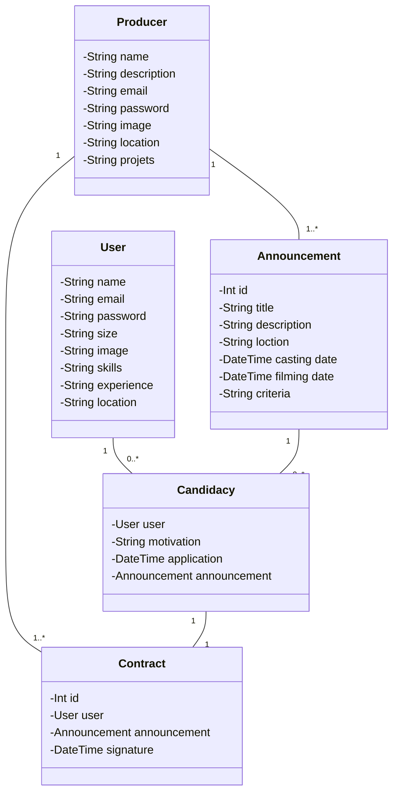

# Diagrammes de séquences

Représentation des classes de l'application Casting.

```mermaid

classDiagram 
    class User {
        -String name
        -String email
        -String password
        -String size
        -String image
        -String skills
        -String experience
        -String location
    }

    class Producer {
        -String name
        -String description
        -String email
        -String password
        -String image
        -String location
        -String projets
    }
    
    class Announcement {
        -Int id
        -String title
        -String description
        -String loction
        -DateTime casting date 
        -DateTime filming date 
        -String criteria
    }

    class Candidacy {
        -User user
        -String motivation
        -DateTime application
        -Announcement announcement
    }

    class Contract {
        -Int id
        -User user
        -Announcement announcement
        -DateTime signature
    }

    User "1" -- "0..*" Candidacy
    Producer "1" -- "1..*" Announcement
    Producer "1" -- "1..*" Contract
    Announcement "1" -- "0..*" Candidacy
    Candidacy "1" -- "1" Contract
```