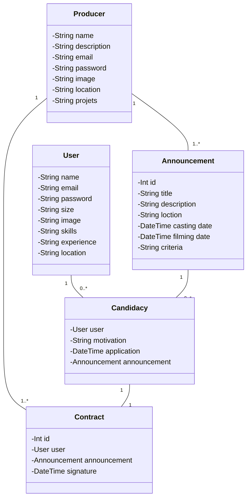
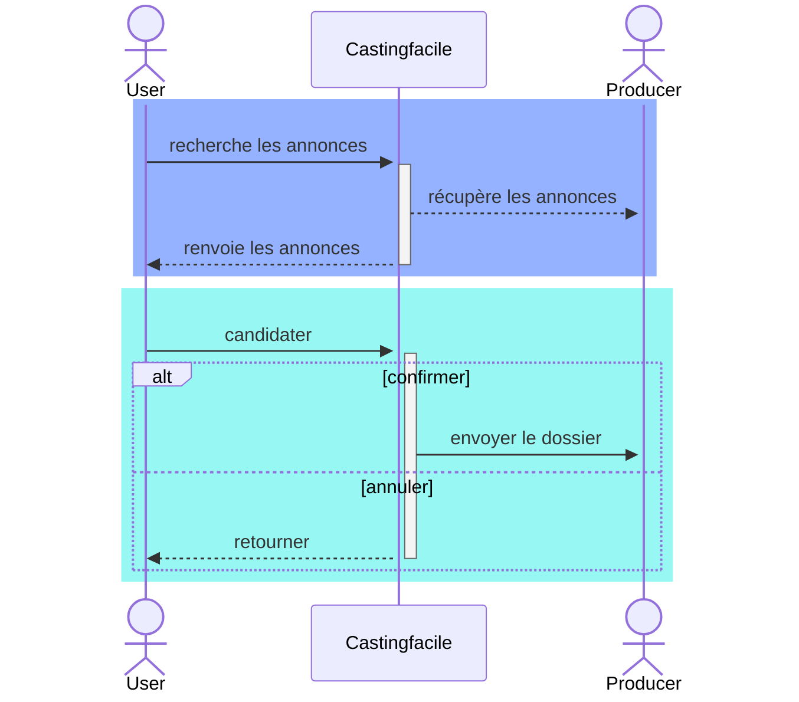
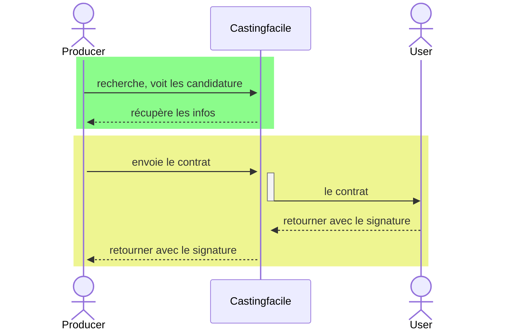

# Diagramme de classe

Représentation des classes de l'application Casting.

```mermaid

classDiagram 
    class User {
        -String name
        -String email
        -String password
        -String size
        -String image
        -String skills
        -String experience
        -String location
    }

    class Producer {
        -String name
        -String description
        -String email
        -String password
        -String image
        -String location
        -String projets
    }
    
    class Announcement {
        -Int id
        -String title
        -String description
        -String loction
        -DateTime casting date 
        -DateTime filming date 
        -String criteria
    }

    class Candidacy {
        -User user
        -String motivation
        -DateTime application
        -Announcement announcement
    }

    class Contract {
        -Int id
        -User user
        -Announcement announcement
        -DateTime signature
    }

    User "1" -- "0..*" Candidacy
    Producer "1" -- "1..*" Announcement
    Producer "1" -- "1..*" Contract
    Announcement "1" -- "0..*" Candidacy
    Candidacy "1" -- "1" Contract

```
---
# Diagramme de séquence

Diagrame de séquence 1

```mermaid
sequenceDiagram
    actor User
    participant Castingfacile
    actor Producer

    rect rgb(148, 178, 255)
        User->>+Castingfacile: recherche les annonces
        activate Castingfacile
        Castingfacile-->>+Producer: récupère les annonces
        Castingfacile-->>-User: renvoie les annonces
    end

    rect rgb(151, 247, 242)
        User->>+Castingfacile: candidater
        activate Castingfacile
        alt confirmer
            Castingfacile->>+Producer: envoyer le dossier
        else annuler
            Castingfacile-->>-User: retourner
        end
    end
```

Diagrame de séquence 1

```mermaid
sequenceDiagram
    actor Producer
    participant Castingfacile
    actor User

    rect rgb(139, 252, 139)
        Producer->>+Castingfacile: recherche, voit les candidature
        activate Castingfacile
        Castingfacile-->>+Producer: récupère les infos
    end

    rect rgb(238, 245, 145)
        Producer->>+Castingfacile: envoie le contrat
        activate Castingfacile
        Castingfacile->>-User: le contrat
        User-->>+Castingfacile: retourner avec le signature
        Castingfacile-->>+Producer: retourner avec le signature
    end
```